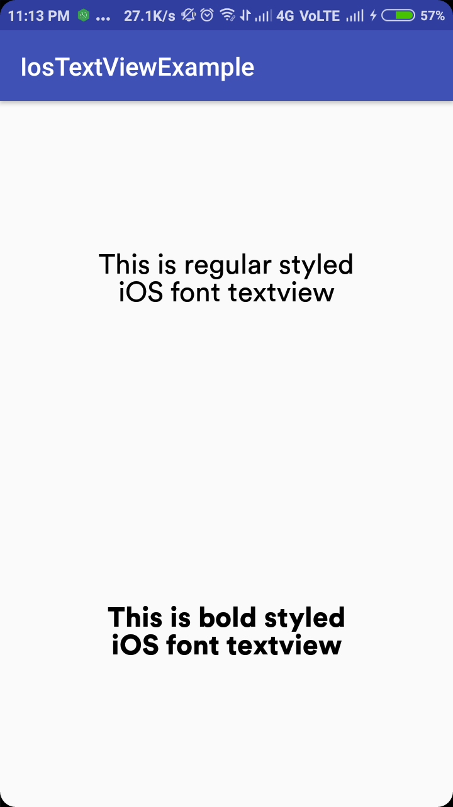

# IosTextView

## Description
Simple textview for android with iOS style fonts.

Screenshot:



## Download

add in your root `build.gradle` :
````
allprojects {
    repositories {
        ...
        maven { url "https://jitpack.io" }
    }
}
````


then add
````
implementation 'com.github.adityasonel:IosTextView:0.2'
````
in your app's `build.gradle`

## Usage

To show regular styled ios text, just use `IosTextViewRegular`, such as
```
<com.adityasonel.ios_textview.IosTextViewRegular
        android:text="This is regular styled iOS font textview"
        android:layout_width="match_parent"
        android:layout_height="match_parent" />
```

And to show bold styled ios text, just use `IosTextViewBold`, such as
```
<com.adityasonel.ios_textview.IosTextViewBold
        android:text="This is bold styled iOS font textview"
        android:layout_width="match_parent"
        android:layout_height="match_parent" />
```

## Note

All default `TextView` or `AppCompatTextView` attributes available.
